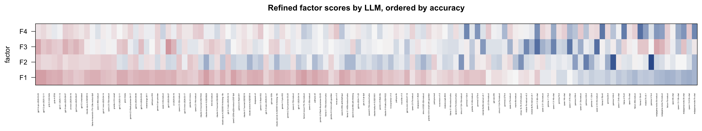
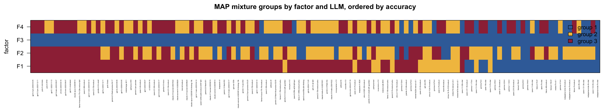

# IFEval Component-Wise Mixture Fit: H=4, G=(3,3,1,3)

This note summarizes a focused IFEval fit of the binary probit independent-mixture factor model with

```text
H = 4
G = (3, 3, 1, 3)
lambda_l1_penalty = 4
pretraining iterations = 20 maximum
MAP refinement iterations = 20 maximum
```

The fitted full-data model stopped after 15 pretraining iterations and 12 MAP refinement iterations. The full-data binary probit log likelihood was `-0.21897` per response. In the completed cross-validation table, this specification has held-out log likelihood `-0.26978` per response, very close to the current best component-wise fit `G=(3,3,2,2)`, which has held-out log likelihood `-0.26944` per response.

## Component-Wise CV Context

The current component-wise CV screen strongly favors `H=4` and `lambda=4`. Among these fits, `G=(3,3,1,3)` is near the top while keeping the third coordinate Gaussian.


This is useful substantively: F3 is retained as a continuous axis, while F1, F2, and F4 are allowed to form discrete model subtypes.

## Marginal Factor Distributions


The fitted marginal mixture structure is:

| Factor | Components | Interpretation |
| --- | ---: | --- |
| F1 | 3 | Broad general instruction-following axis with high/mid/low model groups. |
| F2 | 3 | A discrete axis for language/case/script constraints, especially all-lowercase and single-language requirements. |
| F3 | 1 | A continuous axis rather than a discrete subtype. This is consistent with the earlier finding that extra F3 components mostly model central concentration rather than a meaningful left-tail group. |
| F4 | 3 | A discrete formatting/structured-output axis, including JSON wrapping, sentence-count limits, and local formatting constraints. |

The fitted component sizes were:

| Factor | Component counts |
| --- | --- |
| F1 | 27 / 16 / 79 |
| F2 | 21 / 61 / 40 |
| F3 | 122 |
| F4 | 20 / 50 / 52 |

## LLM Scores and Mixture Profiles

The next two plots show the fitted LLM coordinates. Models are ordered from left to right by empirical IFEval accuracy.



The continuous score heatmap shows the broad role of F1: the highest-accuracy models tend to have high F1 scores, while weaker models tend to move downward on F1. F2, F3, and F4 are less monotone in overall accuracy. They capture different styles of constraint-following rather than just "better versus worse" performance.

The group heatmap translates the continuous scores into factor-wise MAP mixture assignments. F3 is intentionally a single Gaussian coordinate, so every model has group 1 on F3. F1, F2, and F4 show discrete heterogeneity: models can be strong on the broad instruction-following axis while belonging to different F2 or F4 subtypes.



## Loading Matrix


The heatmap displays the fitted item loading matrix, `Lambda`, after permuting the 500 item rows. Each row is one IFEval item and each column is one factor. Red entries are positive loadings, blue entries are negative loadings, and white entries are near zero. Larger absolute values mean that the item's success probability changes more strongly with that factor score.

The row ordering is diagnostic, not part of the fitted model. For each item `j`, define

```text
strongest_factor_j = argmax_h |lambda_jh|
max_abs_loading_j = max_h |lambda_jh|.
```

Rows are sorted by `strongest_factor_j`, then by decreasing `max_abs_loading_j`. Thus, the apparent blocks are not imposed by the model; they are a visualization of the learned loading pattern. The large upper block consists of items whose strongest absolute loading is on F1. The smaller lower blocks consist of items whose strongest loading is on F2, F3, or F4. The fact that these blocks become visible after a genuine row permutation is evidence that the fitted loadings have a broad-plus-specific structure: one dominant general IFEval factor and several smaller private axes.

Among active items with `|loading| > 0.1`, the strongest-factor counts are:

| Strongest factor | Active items |
| --- | ---: |
| F1 | 410 |
| F2 | 37 |
| F3 | 26 |
| F4 | 23 |

The numeric loading summary also shows this structure:

| Factor | Mean abs loading | `|lambda| > 0.5` | `|lambda| > 1.0` |
| --- | ---: | ---: | ---: |
| F1 | 0.863 | 396 | 199 |
| F2 | 0.240 | 38 | 28 |
| F3 | 0.203 | 63 | 13 |
| F4 | 0.222 | 69 | 18 |

## Factor Interpretation

### F1: Broad Instruction Following

F1 is the dominant general axis. High-loading items often combine ordinary task completion with explicit constraints, such as repeating the request exactly, ending with a required phrase, using all caps, or wrapping text in prescribed delimiters.

Representative high-F1 items include:

| Item | Loading | Example constraint |
| --- | ---: | --- |
| `ifeval_20260421T021146Z_127` | 1.785 | End the response with a specified sentence and no words after it. |
| `ifeval_20260421T021146Z_242` | 1.758 | Repeat the request exactly, then answer with a title in double angle brackets. |
| `ifeval_20260421T021146Z_362` | 1.742 | Repeat the request word-for-word before answering. |
| `ifeval_20260421T021146Z_6` | 1.701 | Write two labeled all-caps paragraphs. |

### F2: Language, Case, and Script Control

F2 is more specialized. The strongest positive F2 items emphasize lowercasing, single-language output, and constraints on allowed alphabets or scripts.

Representative high-F2 items include:

| Item | Loading | Example constraint |
| --- | ---: | --- |
| `ifeval_20260421T021146Z_293` | 3.071 | Product description entirely in lowercase. |
| `ifeval_20260421T021146Z_409` | 2.967 | English-only response, all lowercase. |
| `ifeval_20260421T021146Z_280` | 2.963 | Hindi poem, only Hindi, no other language. |
| `ifeval_20260421T021146Z_292` | 2.822 | Haiku in lowercase with no capital letters. |

### F3: Creative Lexical Constraint Axis

F3 is best treated as continuous in this fit. Its high-loading items often require creative generation under severe lexical constraints, such as avoiding or limiting a common letter while still producing a poem, song, quiz, or long essay.

Representative high-F3 items include:

| Item | Loading | Example constraint |
| --- | ---: | --- |
| `ifeval_20260421T021146Z_277` | 1.637 | Write a rubric as a poem while using the letter `w` fewer than two times. |
| `ifeval_20260421T021146Z_477` | 1.565 | Write a song while using the letter `a` at most once. |
| `ifeval_20260421T021146Z_23` | 1.516 | Write a logic quiz while using the letter `t` at most once. |
| `ifeval_20260421T021146Z_147` | 1.324 | Write a long essay of at least 50 sentences. |

The Gaussian choice for F3 is important: it suggests this ability varies continuously across LLMs rather than forming a stable discrete subtype in the current data.

### F4: Structured Output and Local Formatting

F4 captures a smaller but interpretable formatting axis. High-loading items frequently require JSON wrapping, sentence-count limits, required endings, highlighted sections, or other local structural constraints.

Representative high-F4 items include:

| Item | Loading | Example constraint |
| --- | ---: | --- |
| `ifeval_20260421T021146Z_269` | 1.219 | Wrap the entire response in JSON format. |
| `ifeval_20260421T021146Z_58` | 1.213 | Answer in JSON format, with markdown ticks allowed. |
| `ifeval_20260421T021146Z_359` | 1.207 | Use fewer than 10 sentences and end with a required sentence. |
| `ifeval_20260421T021146Z_33` | 1.173 | Use a repeated keyword, fewer than six sentences, and highlighted text sections. |

### Cross-Loading Items

Some items load substantially on more than one factor. These are important because they reveal tasks that mix multiple skill demands. The table below lists examples with at least two loadings above about 0.5 in absolute value.

- `ifeval_20260421T021146Z_80`: F1/F3 cross-loading, with loadings `(F1,F2,F3,F4) = (1.300, 0.198, 1.301, -0.018)`. This item asks for a 30-line poem with exact sentence and punctuation constraints, mixing broad instruction following with creative lexical/form control.

- `ifeval_20260421T021146Z_269`: F1/F4 cross-loading, with loadings `(1.199, 0.000, -0.177, 1.219)`. This item requires JSON wrapping plus ordinary semantic interpretation, mixing general instruction following with structured-output formatting.

- `ifeval_20260421T021146Z_502`: F1/F3 cross-loading, with loadings `(1.230, 0.000, 1.177, 0.290)`. This item asks for a riddle without commas, combining creative generation with punctuation restriction.

- `ifeval_20260421T021146Z_233`: F1/F4 cross-loading, with loadings `(1.507, 0.000, 0.000, 1.151)`. This item asks the model to explain a technical concept for a casual audience and end with an exact required phrase.

- `ifeval_20260421T021146Z_58`: F1/F4 cross-loading, with loadings `(1.027, 0.089, -0.136, 1.213)`. This item asks for a history answer wrapped in JSON, again mixing content generation with rigid structured output.

- `ifeval_20260421T021146Z_343`: F1/F3 cross-loading, with loadings `(1.235, 0.068, 1.016, 0.194)`. This is a comma-avoidance task, where the response must satisfy both content and lexical-control constraints.

These cross-loadings are also visible in the heatmap: many F2-F4-primary rows retain moderate F1 loadings, and many F1-primary rows show secondary structure in F3 or F4. This is why the matrix is not a pure block diagonal matrix. It is closer to a broad general factor with smaller partially overlapping specialized factors.

## Working Interpretation

The `G=(3,3,1,3)` fit gives a clean compromise between predictive performance and interpretability. F1 is the broad general IFEval ability. F2 and F4 describe discrete model subtypes for specialized constraint-following modes. F3 remains a continuous creative-control axis, especially for generative tasks with severe lexical restrictions.

This structure is more interpretable than forcing F3 to have multiple mixture components: when F3 is given two or three components, the extra components tend to model central concentration rather than a meaningful left-tail or high-skill subtype.
